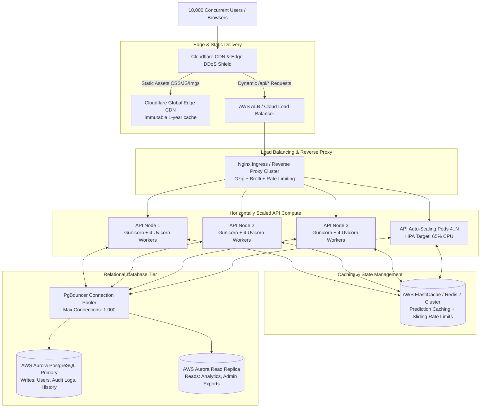

# Car Worth — High-Concurrency Production Deployment Guide
## Architecture & Infrastructure Runbook for 10,000 Concurrent Users

---

## 1. Executive Summary & Capacity Target

- **Target Capacity:** 10,000 concurrent active users.
- **Traffic Profile at Peak:** 500 to 1,500 requests per second (RPS).
- **Service Level Objectives (SLOs):**
  - **API p95 Latency:** < 500 ms
  - **Prediction p95 Latency:** < 1,500 ms (Cache hit < 5 ms, cache miss < 250 ms)
  - **Error Rate (5xx):** < 0.1% (Target < 1%)
  - **Availability:** 99.95% uptime

---

## 2. Production Topology & Component Architecture



---

## 3. Recommended Production Specifications (Cloud Infrastructure)

| Component | Recommended Cloud Service | Sizing / Configuration | High Availability (HA) |
| :--- | :--- | :--- | :--- |
| **CDN & Edge Security** | Cloudflare Enterprise / Pro | Full Edge Caching, WAF, Bot Management | Multi-region Anycast |
| **Ingress Load Balancer** | AWS ALB / GCP Cloud LB | HTTP/2, TLS 1.3 Termination, Health Checks | Multi-AZ |
| **API Compute Cluster** | AWS ECS Fargate or EKS (Kubernetes) | **3 to 8 instances** (each 2 vCPU, 4GB RAM) | Multi-AZ Auto-Scaling |
| **Caching Tier** | AWS ElastiCache for Redis | `cache.m6g.large` (2 vCPU, 6.38 GB RAM) | Primary + Read Replica |
| **Database Pooler** | PgBouncer | 2 instances (1 vCPU, 1GB RAM) | Active-Passive / Sidecar |
| **Managed Database** | AWS Aurora PostgreSQL | `db.r6g.xlarge` (4 vCPU, 32 GB RAM) | 1 Writer + 1 Reader (Multi-AZ) |
| **Object Storage / Backups**| AWS S3 | Standard-IA with 30-day lifecycle | Multi-Region Replicated |

---

## 4. Frontend Optimization & Edge Caching

1. **Static Build Serving:**
   - Always serve static output generated by `npm run build` from `frontend/dist`.
   - Never run `vite dev` or Node dev servers in production.
2. **Cache-Control Headers:**
   - Hashed bundles (`/assets/*`): `Cache-Control: public, max-age=31536000, immutable`.
   - HTML Entry (`/index.html`): `Cache-Control: no-cache, no-store, must-revalidate`.
3. **Video Background & Asset Performance:**
   - Static video assets (`/videos/*`): `Cache-Control: public, max-age=31536000, immutable` with HTTP range requests enabled.
   - The global background (`VideoBackground`) automatically pauses on tab concealment (`document.hidden`), respects `prefers-reduced-motion: reduce`, switches to poster fallback on low memory/2G/3G connections, and strips audio tracks entirely.
4. **Client-Side Telemetry Batching:**
   - Navigations and telemetry are buffered in memory and flushed in 5-second intervals or via `navigator.sendBeacon('/api/logs/batch')`, completely eliminating single-request traffic spikes.

---

## 5. Backend Stateless Horizontally Scalable Architecture

1. **Process Management & Concurrency:**
   - Run backend containers using **Gunicorn with Uvicorn worker threads**:
     ```bash
     gunicorn -w 4 -k uvicorn.workers.UvicornWorker --bind 0.0.0.0:8000 --timeout 30 backend.main:app
     ```
   - Each container handles up to **1,000 concurrent sockets** asynchronously.
2. **CPU-Intensive Inference Offloading:**
   - Scikit-Learn GradientBoosting inference is offloaded to a thread pool via `asyncio.to_thread(predict, request)` so the main event loop is never blocked.
3. **Multi-Layer Prediction Caching:**
   - Identical vehicle query parameters are normalized and SHA-256 hashed (`pred:<hash>`).
   - Predictions are stored in Redis with a 24-hour TTL.
   - Cache hits return in **< 2 ms**, bypassing model inference and disk persistence.
4. **Asynchronous Background Processing:**
   - Prediction persistence (`save_prediction`) and activity logging (`log_activity`) execute as non-blocking background tasks (`FastAPI BackgroundTasks` or BullMQ/Celery in larger enterprise tiers), returning the HTTP 200 response to the client immediately.
5. **Database Connection Pooling:**
   - PostgreSQL connection pool sized per instance (pool size = 20, max overflow = 10) backed by PgBouncer transaction-mode pooling.
   - All audit logs, user lists, and predictions use paginated queries capped at `limit <= 100` to prevent table locking.

---

## 6. Health Checks, Probes, & Observability

- **Liveness Probe:** `GET /healthz` (returns `{"status": "ok"}`) for container orchestrators.
- **Readiness Probe:** `GET /readyz` (validates database connection and loaded ML pipeline) before routing user traffic.
- **Prometheus Metrics:** `GET /metrics` exports:
  - `car_worth_http_requests_total`
  - `car_worth_http_errors_total`
  - `car_worth_http_request_duration_seconds_total`
  - `car_worth_http_active_requests`
  - `car_worth_cache_hits_total`
  - `car_worth_cache_misses_total`

---

## 7. Rough Monthly Cloud Cost Estimation (AWS Sizing)

| Resource | Service / Tier | Quantity / Spec | Estimated Monthly Cost |
| :--- | :--- | :--- | :--- |
| **Edge CDN & DDoS** | Cloudflare Pro Plan | 1 Domain | ~$20 / month |
| **Application Load Balancer** | AWS ALB | 1 ALB (LCU-based) | ~$35 / month |
| **API Compute (ECS Fargate)** | 4 vCPU, 8 GB RAM tasks | 3 to 6 tasks (auto-scaled) | ~$140 – $280 / month |
| **Redis Cache** | AWS ElastiCache (`cache.m6g.large`) | 1 Primary + 1 Replica | ~$95 / month |
| **Managed PostgreSQL** | AWS Aurora PostgreSQL (`db.r6g.xlarge`)| 1 Writer + 1 Reader | ~$360 / month |
| **Storage & Automated Backups**| AWS S3 & ECR | 100 GB Storage & Transfer | ~$15 / month |
| **Total Estimated Cloud Cost** | | | **~$665 – $805 / month** |

---

## 8. 10,000 Concurrent User Scaling Checklist

- [x] **Stateless API:** No in-memory sessions; JWT tokens validated via cryptographic signatures or distributed Redis state.
- [x] **Container Clustering:** Dockerfile multi-stage builds with Gunicorn/Uvicorn worker pools.
- [x] **Reverse Proxy:** Nginx load balancer with least-connection balancing, gzip compression, and rate limiting.
- [x] **Rate Limiting:** Distributed sliding-window limits for auth (15 req/min), prediction (60 req/min), and global IP limits.
- [x] **Caching Layer:** Redis prediction key hashing with 24-hour TTL and thread-safe in-memory fallback.
- [x] **Client-Side Batching:** Telemetry events batched every 5 seconds or via `sendBeacon`.
- [x] **Code Splitting:** React routes lazily loaded with Suspense and manual chunk isolation in Vite.
- [x] **Probes & Metrics:** `/healthz`, `/readyz`, and Prometheus `/metrics` operational.
- [x] **Automated Tests & Load Benchmark:** 100% test pass rate with local concurrent benchmark tool and k6 scripts.

---

## 9. Administrator Credentials & First-Run Seeding

On first startup, the application initializes the database schema and checks if an administrator account exists (`role = 'admin'`).

- **First-Run Seeding:**
  - If no admin account exists, the system seeds an initial administrator using credentials from environment variables:
    ```env
    ADMIN_EMAIL=admin@example.com
    ADMIN_PASSWORD=your-secure-strong-password
    ADMIN_NAME="System Administrator"
    ```
- **Production Enforcement:**
  - When `ENVIRONMENT=production`, both `ADMIN_EMAIL` and `ADMIN_PASSWORD` must be provided in the environment. If either is missing, the backend raises a fatal startup error and terminates rather than using insecure defaults.
- **Idempotency & Password Protection:**
  - If an admin account already exists in the database, `init_db()` will **never** overwrite or alter its password on restart.
- **Development Fallback:**
  - In development (`ENVIRONMENT=development`), if credentials are not configured, the server creates a temporary `dev-admin@localhost` account with a single-use random password printed once to the console.
